# ERD — PanduPOS Enterprise V1 (Mermaid)

```mermaid
erDiagram
    TENANTS ||--o{ BRANCHES : has
    TENANTS ||--o{ WAREHOUSES : has
    TENANTS ||--o{ REGISTERS : has
    TENANTS ||--o{ USERS_MEMBERSHIPS : has
    USERS ||--o{ MEMBERSHIPS : has
    BRANCHES ||--o{ WAREHOUSES : has
    BRANCHES ||--o{ REGISTERS : has

    TENANTS {
        bigint id PK
        uuid uuid UK
        string name
        string slug UK
        enum status "trial,active,past_due,suspended,cancelled,archived"
        string timezone
        string currency
        string locale
        string logo
        json settings
        timestamp trial_ends_at
    }
    BRANCHES {
        bigint id PK
        bigint tenant_id FK
        string name
        string code
        boolean is_active
    }
    WAREHOUSES {
        bigint id PK
        bigint tenant_id FK
        bigint branch_id FK
        string name
        string code
    }
    REGISTERS {
        bigint id PK
        bigint tenant_id FK
        bigint branch_id FK
        string name
    }
    MEMBERSHIPS {
        bigint id PK
        bigint user_id FK
        bigint tenant_id FK
        json branch_ids
    }

    MODULES ||--o{ TENANT_MODULES : enabled_for
    TENANTS ||--o{ TENANT_MODULES : has
    MODULES {
        bigint id PK
        string slug UK
        string name
        string version
        string category
        string status
        boolean is_core
        boolean is_paid
    }
    TENANT_MODULES {
        bigint tenant_id FK
        bigint module_id FK
        boolean enabled
        json settings
    }

    PLANS ||--o{ PLAN_ENTITLEMENTS : has
    PLANS ||--o{ SUBSCRIPTIONS : has
    TENANTS ||--o{ SUBSCRIPTIONS : has
    PLANS {
        bigint id PK
        string slug UK
        string name
        decimal monthly_price
        decimal yearly_price
        int trial_days
        boolean is_active
    }
    PLAN_ENTITLEMENTS {
        bigint plan_id FK
        string entitlement
        string value "bool|int|null=unlimited"
    }
    SUBSCRIPTIONS {
        bigint id PK
        bigint tenant_id FK
        bigint plan_id FK
        enum status "trialing,pending,active,past_due,grace_period,suspended,cancelled,expired"
        enum billing_cycle "monthly,quarterly,semiannual,yearly,lifetime"
        timestamp starts_at
        timestamp trial_ends_at
        timestamp current_period_start
        timestamp current_period_end
    }

    TENANTS ||--o{ CONTACTS : has
    CONTACTS {
        bigint id PK
        bigint tenant_id FK
        enum type "customer,supplier,both"
        string name
        decimal credit_limit
    }
    TENANTS ||--o{ PRODUCTS : has
    PRODUCTS {
        bigint id PK
        bigint tenant_id FK
        string name
        string sku
    }
    PRODUCTS ||--o{ PRODUCT_VARIANTS : has
    PRODUCT_VARIANTS {
        bigint id PK
        bigint product_id FK
        string sku
        decimal purchase_price
        decimal sell_price
    }
    STOCK_MOVEMENTS {
        bigint id PK
        bigint tenant_id FK
        bigint warehouse_id FK
        bigint variant_id FK
        string ref_type
        bigint ref_id
        enum movement_type "in,out,adjust,transfer"
        decimal qty
        decimal unit_cost
        timestamp occurred_at
    }
    WAREHOUSES ||--o{ STOCK_MOVEMENTS : has
    PRODUCT_VARIANTS ||--o{ STOCK_MOVEMENTS : has

    SALES_INVOICES ||--o{ SALES_LINES : has
    SALES_INVOICES ||--o{ PAYMENTS : has
    SALES_INVOICES {
        bigint id PK
        bigint tenant_id FK
        bigint branch_id FK
        bigint contact_id FK
        string invoice_no
        enum status "draft,final,void"
        decimal total
    }
    PURCHASES {
        bigint id PK
        bigint tenant_id FK
        bigint contact_id FK
        enum status "draft,ordered,partial,received,cancelled"
    }

    AUDIT_LOGS {
        bigint id PK
        bigint tenant_id FK
        bigint actor_id
        string action
        string subject_type
        bigint subject_id
        json before_json
        json after_json
    }
```

**Notes:** All business tables carry `tenant_id` + index. `stock_movements` is append-only truth; `stock_on_hand` is a view. Invoices immutable; corrections via credit-notes/returns. Billing tables (`billing_invoices`, `payment_attempts`, `payment_webhooks`) separated from POS `payments`.
